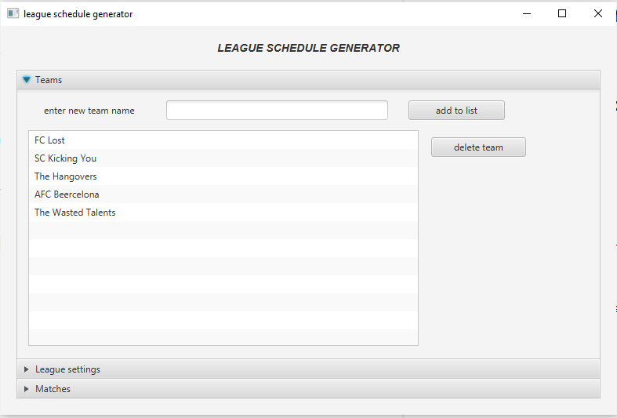
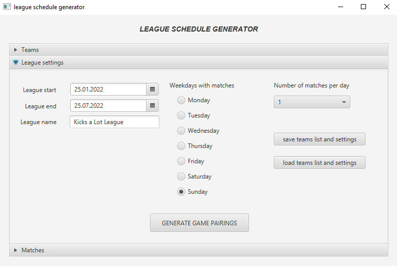
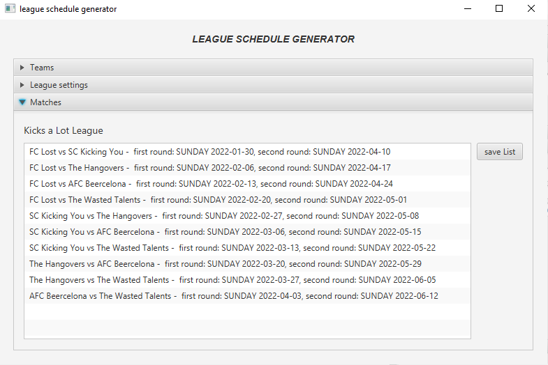

# match-scheduler
generation of match schedules

what is match scheduler?
---------------------------
A Java program for determining match pairings starting from a list of sports teams that together form a league.
Also a JavaFX project of mine for demonstration purposes.

Prerequisites
--------------------------
- a Java 17 runtime environment or jdk.
- an IDE with Maven plugin (project was created in IntelliJ Idea)
- JavaFX - since Java 11 JavaFX is no longer part of the JDK so you need some extra dependencies. See [pom.xml](https://github.com/slawidev/match-scheduler/blob/master/pom.xml).
- Click [here](https://openjfx.io) for more Info about JavaFX.

How it works
--------------------------
The user interface is divided into three JavaFx elements called "TitledPanes".
On the "Teams" pane you can add or remove teams from the league.
On the "League settings" pane you can set a start and end date for the season. You can choose on which days of the week matches will be played and how many matches will be played per day.
You can also save the settings as a file or import old settings.
After finishing the configuration you can start with the button "Generate Game Pairings" the determination of the game dates.
The result is transferred to the "Matches" pane. Here is also the possibility to save the result as a text file.

How to start it
--------------------------
Clone the repository, open a terminal, change into project folder and start the application with "mvn clean javafx:run".
